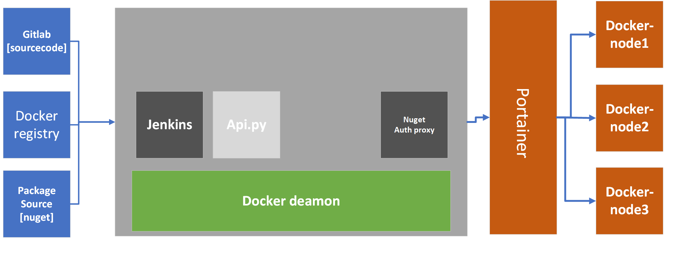

#  jenkins-cicd 
>
> devops工具链,  基于docker register仓库, docker portainer容器管理
>

## 架构如下

## 功能
- base on jenkins
- base on docker register hub
- base on portainer management

## 依赖
- docker registry [harbor]
- portainer (docker management)
- git-server
- docker /docker-compose

## [发展历程](docs/staging.md)

## [开始使用](docs/getting-start.md)

