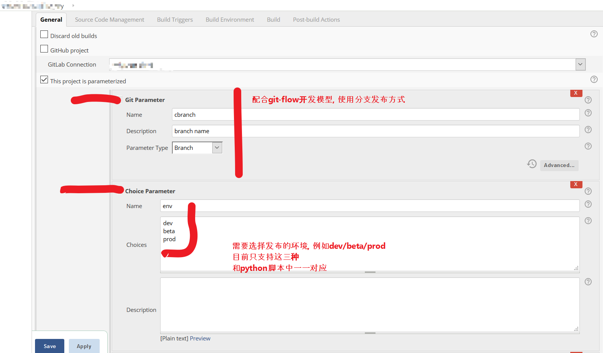
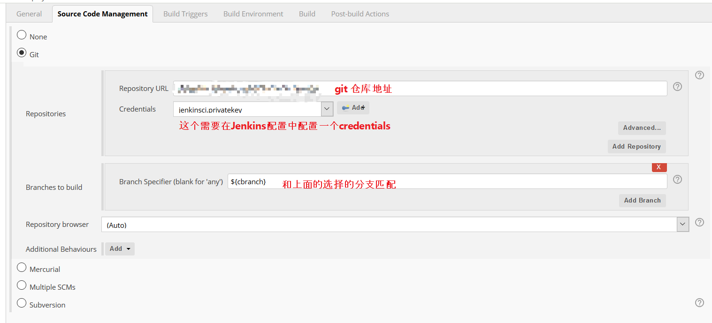

## Quick-Start
- 运行sshkey/genssh.sh 创建ssh-key

  - 如果不使用git rep, 也可以跳过这一步,这是为了拉取git代码配置的sshkey

- 支持.net/nuget-server 

  - 修改NuGet.config 配置支持private-repos认证

- 修改配置文件docker-compose.ci.env, 

  - 配置相关的docker-register信息和 portainer的配置信息

- docker-compose up -d 启动

- 登陆Jenkins, 初始化用户名密码

- install jenkins-plugins 
  - ```bash [./tools/bulter ]butler plugins import --server localhost:8080 --username admin --password admin```


## samples

- 配置发布方式




- 配置git



- build shell

```bash

projectPath="src/PushSrv/FM.Push.Srv/"  
projectName="FM.Push.Srv.csproj"  
dockerImgName="cs-push-grpc-srv"
dockerfile="./dockerfile/service_dockerfile"
##依赖于CHANAGELOG 来标识docker/gittag
tag=`head -1 CHANGELOG`

dotnet publish -o out  -c Release "$projectPath""$projectName"
mv "$projectPath"out/*  out/application

cp $dockerfile ./out/application/Dockerfile
cd out/application
local_docker_image_name=$(printf '%s:%s' $dockerImgName $tag)


function GetParameterValue()                 
{                                            
    #$1  env :dev/beta/prod                  
    #$2  _docker_username                    
    ename=$1$2                               
    value=$(eval "echo \"\$$ename\"")        
    echo $value                              
}                                           
dockerhubgroup=$(GetParameterValue $env "_dockerhub_group")
dockerhuburl=$(GetParameterValue $env "_docker_hub_url")
dockerhubuser=$(GetParameterValue $env "_docker_username")
dockerhubpass=$(GetParameterValue $env "_docker_password")
dockerhubdomain=$(GetParameterValue $env "_dockerhub_domain")


docker build -t $local_docker_image_name .
full_docker_image_name=$(printf '%s/%s/%s:%s' $dockerhubdomain $dockerhubgroup $dockerImgName $tag)

echo 'push to register'
docker login -u $dockerhubuser -p $dockerhubpass $dockerhuburl
docker tag $local_docker_image_name $full_docker_image_name
docker push $full_docker_image_name


if [ "$env"  = "dev" ]; then
	python /root/pubtool/main.py --deploy_env=dev --docker_env="ASPNETCORE_ENVIRONMENT=Development" --docker_env='ASPNETCORE_ENDPOINT=192.168.8.11' --node=1 --container_name="$dockerImgName" --docker_image="$local_docker_image_name"
elif [ "$env"  = "beta" ]; then
	echo "publish to beta"
    python /root/pubtool/main.py --docker_env='ASPNETCORE_ENVIRONMENT=Staging' --deploy_env=beta  --node=2 --container_name="$dockerImgName" --docker_image="$local_docker_image_name"
elif [ "$env"  = "prod" ]; then
	echo "publish to prod"
    python /root/pubtool/main.py --docker_env='ASPNETCORE_ENVIRONMENT=Production' --deploy_env=prod  --node=7 --container_name="$dockerImgName" --docker_image="$local_docker_image_name"
else
	echo "unknow"
  exit 1
fi

```

- finish

  届时就可以在UI上选择发布相应的分支到相应的环境中了
  
  


